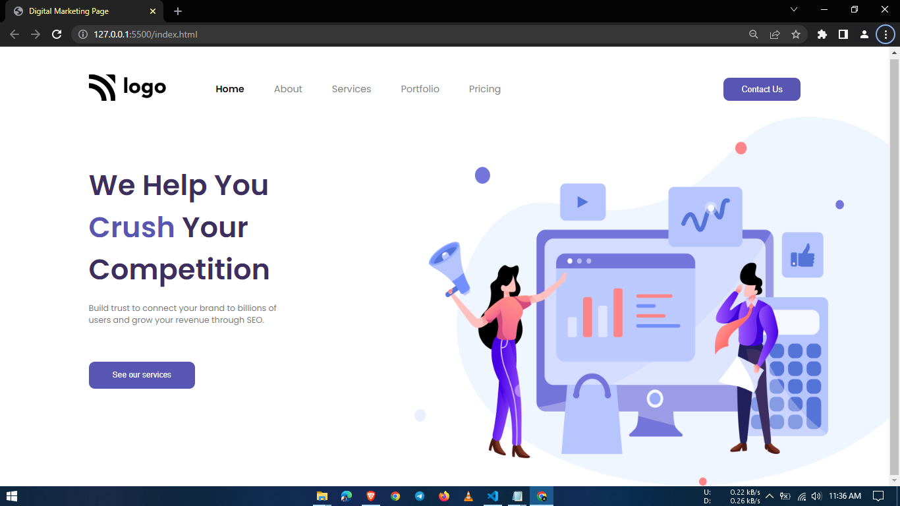

# 4-Digital-marketing-landing-page
It is part of the Full Stack Javascript Bootcamp being taught at ineuron.ai by Hitesh Choudhary Sir.

## Project 4 [Live Link](https://digital-marketing-landing-pages.netlify.app/)

-   During this project, I gained the following skills:
    -  I learned how to use SVG as a background image.
    -  :nth-child(), :first-child & :last-child can be used to select any specific element.

---

## Time taken to finish this project

-   2 hour to complete it.

#### Screenshot

